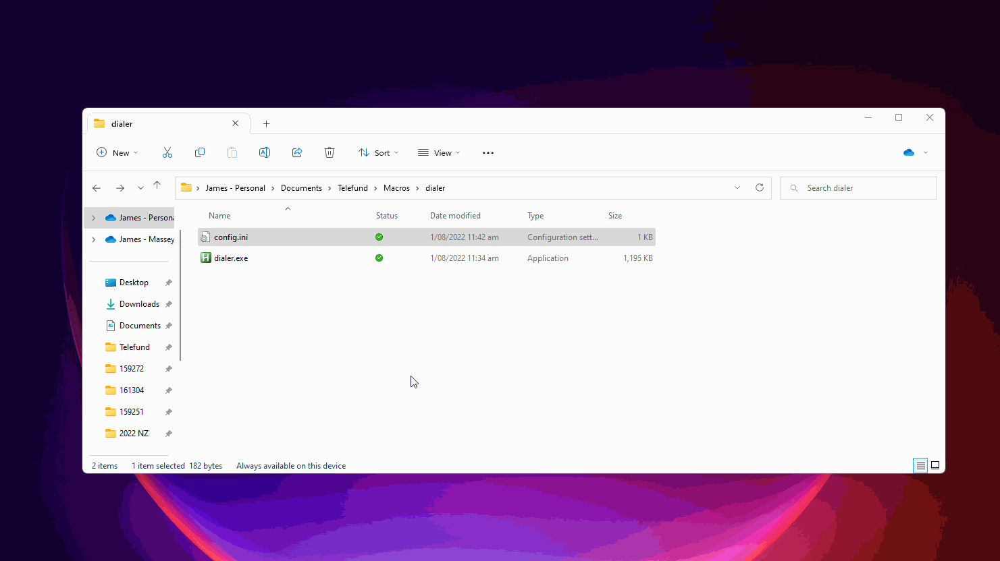
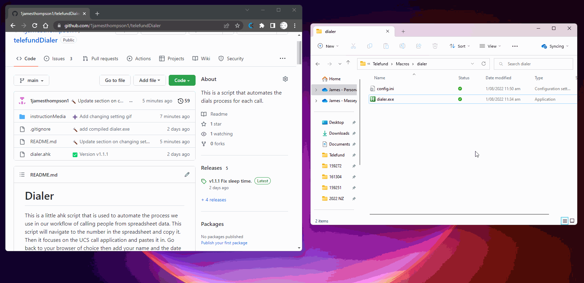

# Dialer

This is a little ahk script that is used to automate the process we use in our workflow of calling people from spreadsheet data. This script will navigate to the number in the spreadsheet and copy it. Then it focuses on the UCS call application and pastes it in. Go back to your browser of choice then add your name and the date in the cell adjacent to each other.

You can contact me via email for this project specifically at jamestelefund@gmail.com

## User Guide

### Installation
1. Naviagte to [releases](https://github.com/1jamesthompson1/telefundDialer/releases)
2. Click on dialer.exe. This will download it to your default download location. There may be an antivirus warning in there just ignore it.
3. Move it to your prefered location (optional)
Here is the steps as a gif:  

### Setup
When running for the first time it will do a setup. This will create a config file
1. Double click on dialer.exe
2. Enter your name into the prompt
3. Enter the width of the spreadsheet (see below for more information)  
It should be good to go now from shift to shift.
Here it is as a gif:  

UCS also needs to be ready to be used as this uses the call assistance box instead of the base ucs.  
To activate this:  
1. Go to tools
2. Press call assistance. This box can be moved anywhere it doesn't matter.
Here is an example of me enabling UCS call asisstance:  

### Using

#### Running script  

You will have to run the dialer.exe file at the start of your shift and any time you want to change the width of the spreadsheet.
To do this simply
1. Double click on dialer.exe
2. Enter the width of the spreadsheet  
The script is now running and can be used.  
See below for how to use the script
#### Dial

**Shortcut:** Rctrl  
**Basic Functionality**  
This action will start at the outcome column. Move left in the spreadsheet the entered number of times then copy and enter the phone number into the UCS box. Then it will head back to the spreadsheet and navigate to where your Name and the date should go and enter those accordingly.  
**Special Cases**  
If the call date and time is already filled out it will enter in AP into outcome column and call the row below.  
If the current call attempt has an outcome already entered there it will simply drop down to the row below and dial instead.  
**Modifiers:**  
 - Left or Right arrow: Pressing either of the arrows at the same time as Rctrl will make the script grab the phone number from the column to either the left or right (depending on the direction of the arrow). You might notice that when you press left or right arrow that you move your selected cell one of those directions but it wont affect it..  
 - RShift: Pressing Right SHift at the same time as Rctrl will only enter your name and date time. It must be triggered on the caller name column to work correctly.  

**Exmaple** I first use the differnt shortcuts and features as follows; default dial, auto ap dial, auto skip row dial, left modifier, right modifier.

The **width** of the sheet is the number of cells between the outcome column and the phone number column you are trying to call. Image it like the number of times you would have to press the left button to get to the right number cell (as this is literally what it is doing). Here is a photo example of a width of 5 when doing first calls.

### Changing setting
Settings can be changed for your particular dialer installation.

This can be done by using the config.ini file. It is important that you dont leave spaces where there arent supposed to be. For example after the equals character should be the value (no space inbetween or after). If you think that you have broken it you can simply delete the file and re run the script and it will set itself up again. You must not forget to save youo changes before closing the file.

Settings that you might want to change:
 - **sleepTime**: This is how much the script will sleep between each action. Default is 100 but for a slow computer you could try 150 or 200
 - **browser**: what the script will focus on. Default is chrome.exe.
 - **userName**: The name that the script will enter into the workbook. Default is what you enter on first running the script.
 
 Here is a demonstration of me changing sleepTime from 100 to 150:
 
 
 
 ### Updating version
 Updated version of this script will be released on occasion to fix things or make them better.
 
 To update you simply need to delete all your previous version files. Then you simply install the latest version found in the releases seciton. It will automaticlly show the most recent at the top. 
 
  Here is a demonstration of doing this:
 
 
 
 When deleting previous version files you must make sure that it isnt current running. If it comes up with an error you can delete it by going to bottom right hand of your screen. Left clicking up arror. Right clicking on the headset icon. Left click exit. See below:
 
 
 
## Repo Guide

### Commit messages
They will be sorted into a category with these emojis found below

➕ `:heavy_plus_sign:` when adding a file or implementing a feature 
🔨 `:hammer:` when fixing a bug or issue 
📜 `:scroll:` when updating docs, readme or comments 
✅ `:white_check_mark:` when a release is made 
👕 `:shirt:` when refactoring or removing linter warnings 
❌ `:x:` when removing code or files 

### Versioning
I am using semantic versioning. No originality here just using the guidelines found at https://semver.org/.  
In short, this will mean Major will be big updates. Minor are any updates that aren't too big and also arent backward compatible. Lastly, patches are simple fixes that are not required but might fix a little behaviour. Always should be backward compatible.
